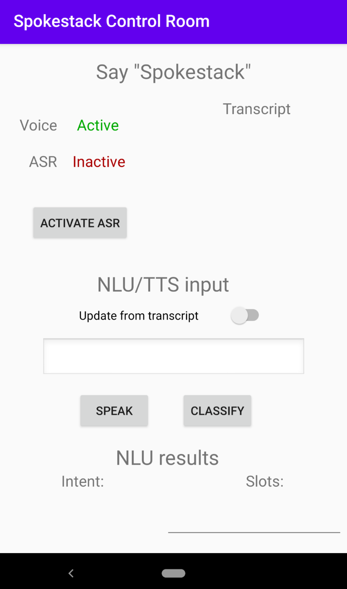

# Spokestack Control Room

This is a simple Android app that demonstrates the core features of [Spokestack Android](https://github.com/spokestack/spokestack-android). It was created by cloning the [Android skeleton](https://github.com/spokestack/android-skeleton) project and modifying `MainActivity`.

---
## Prerequisites/Notes

### Android NDK setup

Because Spokestack relies on native libraries for some audio processing tasks to optimize performance, you'll need the Android NDK to build this project. You can install it by opening the SDK manager in Android Studio, selecting the SDK Tools tab, and setting the `ndkVersion` property in the `android` block of  your app-level `build.gradle` file. The NDK can also be downloaded [directly from Google](https://developer.android.com/ndk/downloads). The property has been set in this project to the current version at the time of writing, so it may need to be updated.

### Wakeword detection

Just like the skeleton project mentioned above, this demo is configured to use wakeword detection provided by [TensorFlow Lite](https://www.tensorflow.org/lite) models. These models are trained to respond to the "Spokestack" wakeword. They must be downloaded and placed in `src/main/assets`. The file names should not be changed.
- [detect](https://d3dmqd7cy685il.cloudfront.net/model/wake/spokestack/detect.lite)
- [encode](https://d3dmqd7cy685il.cloudfront.net/model/wake/spokestack/encode.lite)
- [filter](https://d3dmqd7cy685il.cloudfront.net/model/wake/spokestack/filter.lite)

### Speech recognition

To avoid the need to obtain API credentials to use this demo, Android's on-device ASR API is used. Support for this API, however, is device-dependent. See the [device compatibility chart](#device-compatibility) at the bottom of this document to see if support for your device has been tested. Note that testing ASR on the emulator will not work since [it cannot record audio](https://developer.android.com/guide/topics/media/mediarecorder).

If you're unable to get on-device ASR to work, you can try using a different ASR provider. You'll need to set up an account with [Google Cloud Speech](https://cloud.google.com/speech-to-text) or [Azure Speech Services](https://azure.microsoft.com/en-us/services/cognitive-services/speech-services/), but both currently have free trials. See the [SpeechPipeline configuration documentation](https://spokestack.io/docs/Android/speech-pipeline) for info about changing the configuration used in this project.

---

## Description

Here's a screenshot of `MainActivity` in action, so we can talk about what's going on.

A Spokestack `SpeechPipeline` is built and started after the audio recording permission is granted, so the microphone is active, and Spokestack is waiting to hear its wakeword. The text next to the `Voice` label will display `Active` whenever _any_ speech is detected (otherwise known as [voice activity detection](https://en.wikipedia.org/wiki/Voice_activity_detection)). Random room noise will occasionally be detected as speech.

If the word "spokestack" is detected by the on-device wakeword model (or if the `Activate ASR` button is tapped), the text next to the `ASR` label will display `Active`, indicating that speech is being sent to the chosen speech recognition provider. Errors during this process are displayed as toasts at the bottom of the screen. When ASR is done detecting speech (after the user stops speaking for a configurable amount of time; again, see the configuration documentation for more info), the text of the detected speech will be displayed right under the `Speech Transcript:` label.

The bottom part of the screen is for testing Spokestack's TTS service. If you'd like Spokestack to simply echo back what you've said, toggle the `Update from transcript` switch; otherwise you can enter the text to be spoken into the text field just above the `Speak` button.

That's it! Happy testing!

---

## Device compatibility

This chart lists physical devices on which the Control Room app has been tested by either the Spokestack team or our community. If you have a device that is not listed, please try it out and [submit a PR](https://github.com/spokestack/android-control-room/pulls) with your results!

| Device           | API Level | Launches?          | On-device ASR?     |
| -------------    | --------- | ------------------ | ------------------ |
| Moto X (2nd Gen) |        22 | :white_check_mark: | :x:                |
| Pixel 1          |        29 | :white_check_mark: | :x:                |
| Pixel 3 XL       |        29 | :white_check_mark: | :white_check_mark: |
